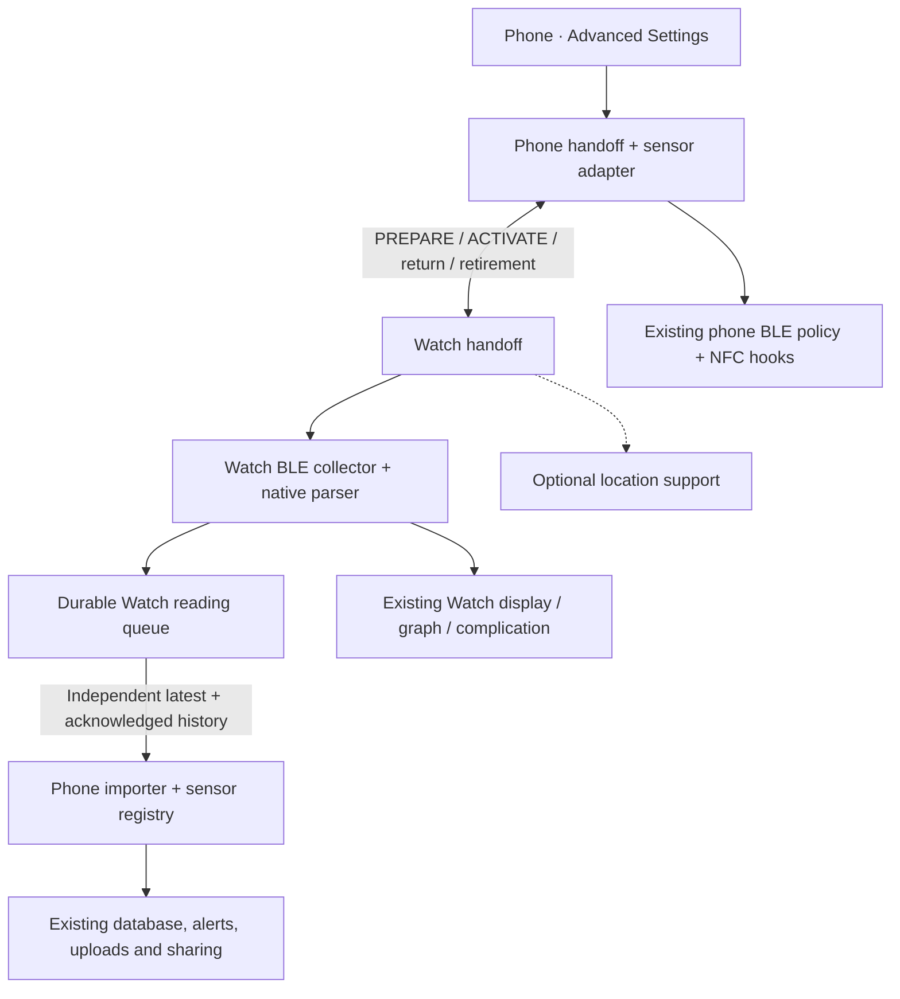

# Implementation guide

The add-on compiles into the existing iPhone and Watch targets. It is not a separate plugin. The audited comparison base is upstream master `53b3d6bf1b550c99b19c3d5d2c2f80dd226465d8`. Paths below are relative to the add-on unless stated otherwise.

## Read the implementation in this order

| Responsibility | Entry points |
| --- | --- |
| Stored ownership and credentials | `Shared/DataModels/Libre2Ownership.swift`, `Libre2WatchSession.swift`, `Libre2NFCCredentials.swift`; `Shared/Managers/Libre2SessionStore.swift` |
| Phone switching and sensor bridge | `iPhone/Managers/Libre2PhoneHandoff.swift`; `iPhone/BluetoothTransmitter/Libre2PhoneSensor.swift`, `Libre2PhoneSensorAdapter.swift` |
| Watch switching and collection | `Watch/Managers/Libre2WatchHandoff.swift`; `Watch/BluetoothTransmitter/Libre2WatchCollector.swift` |
| Native BLE protocol | `Shared/Protocol/Libre2Core.swift`, `Libre2Crypto.swift`, `Libre2FrameAssembler.swift`, `Libre2Calibration.swift` |
| Reading delivery and import | `Watch/Managers/Libre2WatchHistorySync.swift`, `iPhone/Managers/Libre2PhoneHistorySync.swift`; shared `Libre2HistoryQueue`, `Libre2HistoryRegistry` |
| Existing display and downstream services | `Watch/Managers/Libre2WatchManager.swift`, `Watch/DataModels/WatchStateModel+DirectLibre.swift`, `iPhone/Managers/Libre2PhoneReadingProcessing.swift` |
| Optional execution support | `Watch/Managers/Libre2WatchLocationSession.swift`, `Libre2WatchConnectivityTasks.swift`, `Libre2WatchNotificationTest.swift` |
| Phone UI and basic activity | `iPhone/SwiftUIViews`; `Shared/Managers/Libre2ActivityLog.swift` |

## Switching rules

**Phone → Watch:** persist PREPARE while retaining the existing phone connection; Watch validates and persists, then replies READY. Phone disables further Libre operations and waits for confirmed local disconnect before ACTIVATE. Watch cannot connect before ACTIVATE.

**Watch → phone:** phone requests return. Watch freezes its counter and sends RETURN_PREPARE(M). Phone persists M and replies READY. Watch disconnects, then sends RETURN_COMMIT. Phone resumes with stored M; its next authentication advances to M+1. Interrupted return can resume from the persisted phase.

**Ordinary NFC after experimental use:** phone retires the old handoff and provisions new credentials. NFC success and confirmed phone disconnect are required before resuming phone BLE. Retired IDs are queued, sent on restored reachability and included with switching commands. Watch persists retirement before disconnecting and acknowledges only after local release. Repeated messages share that barrier; obsolete/malformed commands cannot partially retire a session. An unreachable Watch cannot react until delivery occurs.

`Libre2Owner` records transaction phases, not display states. Matching handoff ID and phase prevents late replies from advancing a superseded transaction. Each attempted unlock counter is persisted before writing F001 and is never reused. Exhaustion blocks further authentication. Failures never silently authorize both collectors.

`Libre2NFCCredentials` exists only after successful provisioning and holds UID, unlock code and counter. Pending provisioning uses `phoneNFCResetCode`. The existing `reclaim` storage key remains a simple Codable name mapping, without a migration path. Ownership and history use separate atomic JSON journals through `Libre2JournalFile`; each keeps its own failure policy.

## Collection and display

Watch reconnect follows the phone's policy: retrieve a saved peripheral at startup, reuse the callback's peripheral directly after a disconnect or failed connection, and leave known-peripheral connection requests pending. Scan-discovered connections use a five-second connection timeout. Service discovery processes available results even alongside an error; only a nil service list disconnects, retaining the peripheral until its disconnect callback triggers the ordinary direct peripheral reconnect. Missing characteristics, subscription failures and unlock-write errors are logged without cancelling a connected link, matching the phone. There is no deliberate retry backoff, scan deadline or first-reading deadline. Double-tap and connection-timeout recovery resume scanning as soon as cancellation is requested; handoff release still waits for all cancelled handles to disconnect; persistence/ownership failures continue to prevent authentication. The antenna reflects the Bluetooth link, not setup success.

Like the phone, cancellation first requests F002 unsubscription when the current connection has a receive characteristic, without waiting for acknowledgement. A late callback from an old peripheral cannot unsubscribe the current link.

Double tap cancels current work and queues an immediate scan; overlapping taps before that scan share one restart. Advertisements from a still-disconnecting handle are ignored. Late terminal callbacks cannot clear a reused handle that is already connecting or connected. Retired handles are tracked only to preserve the release barrier if a phone return interrupts local recovery. Return or retirement supersedes restart. Late cancelled callbacks cannot authenticate or publish readings. `ConnectionState` drives the antenna independently of durable ownership; a plain change callback refreshes display without polling.

The parser requires native calibration. It validates the newest sample before changing its history cache, then preserves the ported conversion, overlap and short-gap interpolation. The collector queues only the newest real measurement; interpolated graph points are display-only. Invalid glucose does not force a BLE disconnect. The original phone parser, crypto and NFC reader remain in use on iPhone.

Units and limits are persisted independently of a handoff. The existing complication cache supplies initial preferences if dedicated values are absent. Direct mode excludes relayed phone glucose from overwriting Watch readings, but accepts current phone settings. The original complication provider needs no add-on code.

## Synchronisation

The latest reading uses background application context and live messaging when reachable. Application context may replace older pending values; it does not release history. The durable outbox retains immutable batches of at most 120 readings until the phone acknowledges storage. A background submission reserves its retry timestamp before sending; retries wait at least five minutes and are driven by existing events. Live history retries have a one-minute throttle. No timer forces delivery.

The phone prioritises latest values after the current save and coalesces identical concurrent imports. Each history batch still receives its own acknowledgement. Sensor mapping, deduplication and durable saves precede acknowledgement. Unknown/deleted mappings move affected readings to the Watch's unresolved collection; valid remaining readings continue as a new batch. Explicit cleanup requires the current count/revision and preserves pending data.

The importer calls the existing downstream processing path. Historical updates fill graphs and configured uploads; only newly current active-sensor readings trigger current-reading effects and missed-reading scheduling. Ordinary phone call order is preserved. Failed or delayed delivery cannot be inferred from companion reachability alone.

## Execution and activity

Location is optional, stores no coordinates and runs only with Watch ownership. New app launches require foreground activation. Water Lock stays manual. The notification test schedules one user-requested notification and changes no delivery policy.

`Libre2WatchConnectivityTasks` finishes system-provided incoming tasks after activation, pending content and dispatched receipt work permit completion. Cancellation releases only its waiter. It provides no outgoing priority or additional runtime session. Use `WKApplication.shared()` for this single-target Watch app; lifecycle notification constants still use the SDK's `WKExtension` namespace.

Basic activity records connection changes, successful saves and errors. One writer per device keeps a bounded local log. Explicit Watch log loading/export is read-only. There are no process/lifecycle, callback-timing or complication-value tracing modules.

## Original repository boundary

Paths here are repository-relative. These are the functional hooks to inspect or reproduce when integrating upstream.

| Original file | Hook |
| --- | --- |
| `xDrip/BluetoothTransmitter/Generic/BluetoothTransmitter.swift` | Default-true connection policy and confirmed-disconnect callback. |
| `xDrip/BluetoothTransmitter/CGM/Libre/Libre2/CGMLibre2Transmitter.swift` | Sensor adapter, BLE observations, counter reservation and experimental NFC-reset hooks. |
| `xDrip/BluetoothTransmitter/CGM/Libre/Utilities/LibreNFC.swift` | Optional unlock-code argument, default 42; original reader operations retained. |
| `xDrip/Managers/Watch/WatchManager.swift` | Keyed message routes and existing session/database access. |
| `xDrip/Managers/Application/RootApplicationCoordinator.swift` | Shared downstream processing and durable-import observation. |
| `xDrip/SwiftUIViews/Settings/Models/SettingsViewDevelopmentSettingsViewModel.swift` | One Advanced Settings entry. |
| `xDrip Watch App/DataModels/WatchStateModel.swift` | Manager, restore/messages, direct-source guards and existing display updates. |
| `xDrip Watch App/xDripWatchApp.swift` | WatchConnectivity background task and test-notification scene. |
| `xDrip Watch App/Views/BigNumberView/BigNumberView.swift` | Antenna and existing double-tap routing. |
| `xDrip Watch App/Views/MainView/MainView.swift` | Existing header double-tap routing. |
| `xDrip Watch App/Views/MainView/SubViews/MainViewInfoView.swift` | Antenna on other value pages. |

Configuration changes comprise Watch Bluetooth/location/underwater declarations, Xcode membership, default build-location settings, ignored local build products and the root README link. The previously tracked machine-specific `.pch` artifact is removed. The phone app delegate, Watch notification controller and complication provider match the audited upstream base.

Retained exceptions to ordinary behaviour: ownership blocks phone Libre operations while unresolved/direct; NFC after experimental use resets credentials; counter exhaustion blocks even ordinary authentication at its maximum; preference restoration and the underwater declaration apply in relay mode too. Queued readings may import after returning to phone. Obsolete ownership phases, revoke messages and pre-`unresolved` history journals are unsupported; rejected history files are not overwritten.

## Optional connection capture

`Shared/Managers/Libre2DiagnosticCapture.swift` owns a bounded append-only Watch event file and small atomic metadata record. `Libre2ActivityLog` forwards ordinary activity while a capture is enabled and routes explicit capture commands through its existing request key. Detailed collector events go directly to the capture; they do not fill the everyday log. Files are independent of ownership, unlock counters and glucose history.

`Libre2WatchCollector` adds observation and per-attempt/reset identifiers without changing scan, cancellation, retry or authentication decisions. `Libre2WatchManager` observes Watch lifecycle/ownership notifications inside the add-on and supplies capture context. Location support only contributes its existing state. No host app delegate or complication changes are needed.

`iPhone/Managers/Libre2CaptureController.swift` starts/stops/inspects captures and downloads a stopped archive in bounded, ID/offset-checked chunks over the existing activity request route. Only a complete download atomically replaces the saved phone report. The experimental Activity & recovery page owns the controls; no automatic diagnostic transfers or new background execution are introduced.
