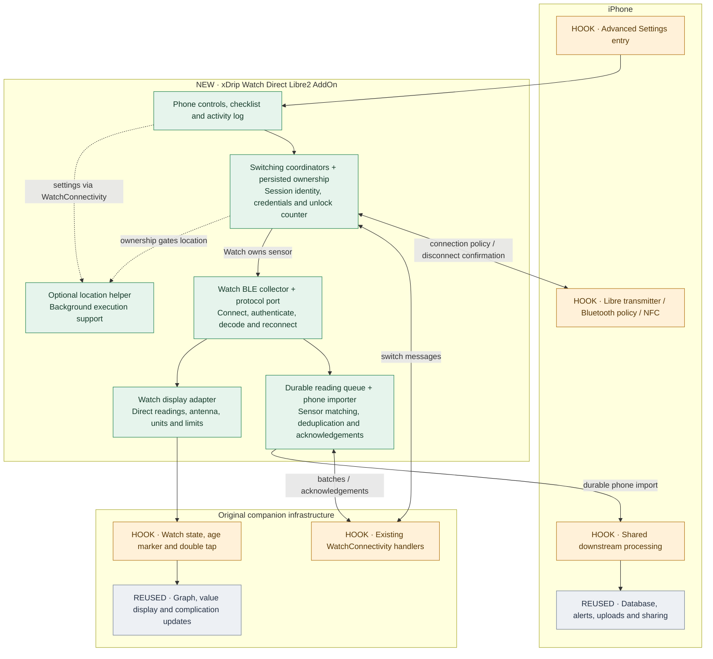
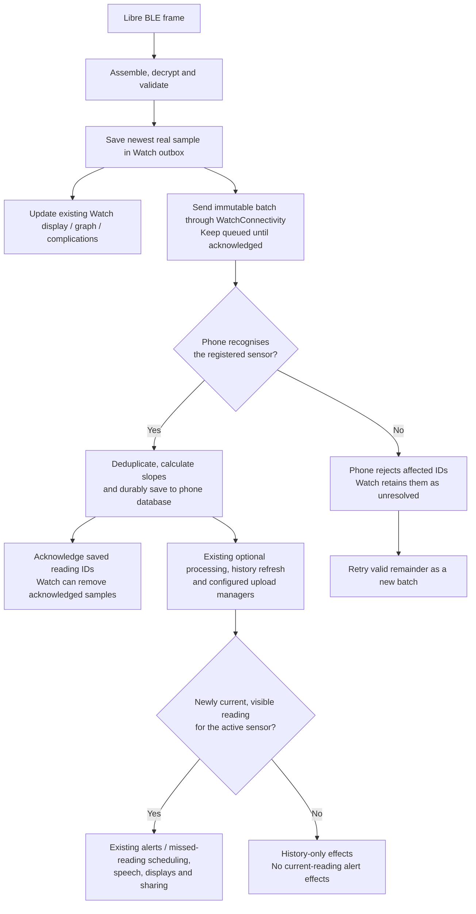
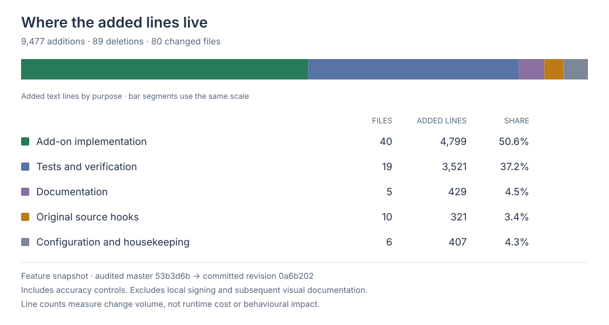

# Architecture and integration

This reference describes the current implementation. Start with the [user guide](../README.md) for operation and [testing guide](TESTING.md) for evidence. The comparison baseline is upstream master `53b3d6bf1b550c99b19c3d5d2c2f80dd226465d8`; no claim is made about an unverified newer master.

## Structure

Green boxes identify new add-on components, amber boxes original integration points we changed, and grey boxes existing services we reuse. The boxes group responsibilities rather than individual files.



The add-on is compiled into the existing iPhone and Watch targets, not loaded as a plugin. `Shared` contains models, persistence and the Watch protocol port; `iPhone` and `Watch` contain platform adapters, managers and views. Tests and scripts are not shipped in app targets. No Loop code is involved.

| Responsibility | Entry points within the add-on |
| --- | --- |
| Phone controls and transactions | `iPhone/Managers/Libre2PhoneHandoff.swift`, `iPhone/SwiftUIViews/Libre2PhoneHandoff+Settings.swift`, `Libre2PhoneExperimentView.swift` |
| Existing phone sensor bridge | `iPhone/BluetoothTransmitter/Libre2PhoneSensorAdapter.swift`; `Libre2PhoneSensor.swift` defines its transport interface |
| Watch orchestration and transactions | `Watch/Managers/Libre2WatchManager.swift`, `Libre2WatchHandoff.swift` |
| Watch BLE and decoding | `Watch/BluetoothTransmitter/Libre2WatchCollector.swift`, `Shared/Protocol/Libre2Core.swift`, `Libre2Crypto.swift`, `Libre2FrameAssembler.swift` |
| Ownership and wire format | `Shared/Managers/Libre2SessionStore.swift`, `Shared/DataModels/Libre2Ownership.swift`, `Libre2WatchSession.swift`, `Libre2HandoffMessage.swift` |
| History transport and import | `Watch/Managers/Libre2WatchHistorySync.swift`, `iPhone/Managers/Libre2PhoneHistorySync.swift`, `Libre2PhoneReadingProcessing.swift`, shared `Libre2HistoryQueue` and `Libre2HistoryRegistry` |
| Display and preferences | `Watch/DataModels/WatchStateModel+DirectLibre.swift`, `Shared/Managers/Libre2ReadingPipeline.swift`, `Libre2WatchPreferences.swift` |
| Optional location support | `Watch/Managers/Libre2WatchLocationSession.swift`, `iPhone/SwiftUIViews/Libre2LocationSettingsView.swift`, shared `Libre2LocationRequest` |
| Diagnostics | `Shared/Managers/Libre2ActivityLog.swift`; bounded logging remains dormant outside experiment/page use |

## Switching and authentication

The phone initiates switching. Both sides persist the sensor identity, credentials, conversion coefficients, handoff ID and unlock counter. The owner and transaction phase guard connection/authentication entry points; a sent message is not proof of a completed handoff.

### iPhone to Watch

```mermaid
sequenceDiagram
    actor User
    participant Phone as iPhone xDrip
    participant Watch as Watch xDrip
    participant Sensor as Libre 2
    User->>Phone: Connect to Watch (Advanced Settings)
    Phone->>Phone: Persist preparingWatch; freeze new authentication
    Note over Phone,Sensor: Existing phone BLE connection stays open during preparation
    Phone->>Watch: PREPARE(session, counter N)
    Watch->>Watch: Validate and persist Prepared state
    Watch-->>Phone: READY(session ID)
    Note over Watch,Sensor: Watch cannot connect yet
    Phone->>Phone: Persist releasingPhone; block phone BLE operations
    Phone->>Sensor: Request disconnect
    Sensor-->>Phone: CoreBluetooth confirms disconnected
    Phone->>Watch: ACTIVATE(session ID)
    Watch->>Watch: Persist Watch ownership
    Watch->>Sensor: Connect, discover F001/F002, subscribe to F002
    Sensor-->>Watch: Subscription confirmed
    Watch->>Watch: Reserve and persist counter N+1
    Watch->>Sensor: Write streaming unlock to F001 using N+1
    Note over Watch,Sensor: Attempted counters are never reused, even after connection loss
    Sensor-->>Watch: Glucose frames
```

### Watch to iPhone

```mermaid
sequenceDiagram
    actor User
    participant Phone as iPhone xDrip
    participant Watch as Watch xDrip
    participant Sensor as Libre 2
    User->>Phone: Return to iPhone (same Advanced Settings button)
    Phone->>Phone: Persist returnRequested; keep phone BLE blocked
    Phone->>Watch: REQUEST_RETURN(session ID)
    Watch->>Watch: Freeze new authentication at current counter M
    Watch->>Phone: RETURN_PREPARE(session, counter M)
    Phone->>Phone: Persist M and returningToPhone
    Phone-->>Watch: READY(session ID)
    Watch->>Watch: Persist releasingWatch; reconnect remains disabled
    Watch->>Sensor: Request disconnect
    Sensor-->>Watch: CoreBluetooth confirms disconnected
    Watch->>Phone: RETURN_COMMIT(session ID)
    Phone->>Phone: Restore phone ownership; retain counter M
    Phone-->>Watch: Acknowledge return
    Watch->>Watch: Retire handoff ID
    Phone->>Sensor: Resume existing connection procedure; next unlock uses M+1
```

Retain these invariants together when modifying the protocol:

- **Confirmed disconnection:** requesting cancellation does not release ownership. Disconnect barriers also apply after restart and during return retries.
- **Persistence before use:** save the reserved counter before writing F001. Once attempted, it is never reused, even if no glucose arrives. Duplicate notification-subscription callbacks do not reserve another counter. Exhaustion at 65,535 requires recovery rather than overflow.
- **Identity and phase validation:** delayed or repeated messages cannot overwrite newer credentials, reduce counters or reactivate a retired session. Unchanged journal transitions do not rewrite storage.
- **No silent takeover:** while Watch owns the sensor, phone scan/reconnect/discovery/subscription/unlock operations remain blocked. Failed or unresolved switching cannot authorize both devices. Imported readings never prove a phone BLE login.

### Reconnection and phone alignment

The Watch retrieves a saved peripheral before scanning, requests reconnection immediately after range loss, and leaves a known peripheral's connection request pending while out of range. Only a scan-discovered connection uses the phone's five-second connection timeout; connection cancels it. There is no scan or first-reading deadline. Explicit protocol failures use a five-second retry backoff.

Manual double tap restarts an idle collector or a connected session stale for three minutes, waiting for confirmed disconnection. Scanning, connecting, disconnecting and fresh sessions remain untouched. Only Watch ownership permits the retry; ordinary display updates do not trigger it.

Startup follows the phone: discover F001/F002, subscribe to F002, then authenticate. Invalid decoded glucose is discarded without disconnecting. Native calibration validation remains mandatory. The Watch trend pipeline follows the phone's thresholds, elapsed-time rules and mmol/L rounding. The iPhone's original NFC, crypto and parser remain in place; Watch protocol code is a port, not a global removal of CoreNFC guards.

### Ordinary NFC recovery

Without experimental state, scans retain the original unlock code (42), commands, callbacks, notices and retry behaviour. A scan-in-progress marker prevents a simultaneous handoff; no experimental journal write is required.

After Direct Libre use, ordinary Add/Connect retires the old session, persists fresh streaming credentials and queues a session-bound Watch revocation. Successful NFC provisioning and confirmed closure of the old phone BLE connection are both required before phone reconnection. Only reset scans clear the NFC-reader reference for retry on the same transmitter instance. Failed/cancelled/interrupted recovery can be retried, including with a different sensor and an unreachable Watch.

`LibreNFC` has only an optional unlock-code argument. There is no second reader, expected-sensor restriction or separate reclaim UI. Experimental errors remain on the Advanced Settings page. Credential reprovisioning can invalidate another app's sensor pairing; software messages cannot instantly disconnect an unreachable Watch.

## Reading storage and synchronisation



Each frame contributes its newest real sample before display; interpolated graph points are not uploaded. An immutable batch holds at most 120 readings and no unlock credentials. Delivery uses existing interactive/queued WatchConnectivity, driven by events rather than a periodic timer. The outbox survives restart until acknowledged.

The phone registry maps a handoff to its original Core Data sensor. Deterministic IDs and switch-boundary checks prevent duplicates. Slopes use existing phone methods with chronological context, including repairs after late inserts. Saving through child, main and persistent-store contexts precedes acknowledgement.

Unknown/deleted mappings produce a rejection bound to batch and reading IDs. A mixed batch is not partially imported: the Watch first persists affected samples as unresolved, then retries the valid remainder under a new batch ID. Storage/transport failures retain the original pending batch. Unresolved samples survive restart/reset and are neither reassigned nor automatically retried. Explicit deletion requires reachability, a current count and revision-bound confirmation; it preserves pending readings and phone history. No queued deletion or automatic expiry exists.

### Reusing phone processing

`RootApplicationCoordinator.processStoredGlucoseData` contains the original downstream block, shared by phone acquisition and Watch imports. Defaults preserve ordinary phone call order and calibration behaviour. Active-sensor imports use existing optional processing/noise managers; ended-sensor imports do not reprocess an unrelated active sensor. Factory-converted Watch values are not calibrated again.

Successful imports refresh displays and invoke configured Nightscout, HealthKit and Dexcom Share managers. Current effects require the newest visible active-sensor reading within the host's 240-second alert window, no future timestamp and no repeated notification in the importer lifetime. The adapter rechecks visibility after processing. Historical, superseded, duplicate or ended-sensor imports cannot produce live alerts, speech, display publishing or OS-AID sharing. Missed-reading scheduling uses measurement time.

Delayed OS-AID sharing rebuilds the existing bounded buffer using stored timestamps, slopes and sharing-value policy; the host retains permissions, delay and app-group writes. The normal 30-second backfill marking threshold and exporter cursors remain. Older imports do not rewind an already-advanced uploader cursor. No new uploader, alarm engine, database schema or background network timer is added.

## Display and execution support

The existing Watch model accepts direct readings through an adapter, retaining graph and complication update paths. BLE callbacks update the antenna independently of freshness. Saved units and four glucose limits restore before collector startup, with complication-cache migration when available. Fresh complete phone settings can arrive during direct collection without importing relayed glucose. Duplicate/invalid/stale settings do not overwrite newer preferences.

Location support is independent of sensor transport. One helper starts standard updates only after opt-in, Watch ownership and foreground activation. It uses When In Use permission, no distance filter, `.other` activity and saved requested accuracy (100, 1000 or 3000 metres). Accuracy changes apply to the same manager without restarting BLE or location. Loss of ownership, disablement or denied permission stops location; temporary missing fixes leave BLE untouched. A new background launch waits for foreground activation. Coordinates are never retained.

The phone reads settings on page entry, foreground return and reachability changes while visible. Interactive acknowledgements determine displayed settings; there is no periodic polling, queued location command or optimistic claim that an unreachable Watch has stopped. Status is last-reported, not continuous execution evidence. Older Watch replies without accuracy still support the toggle but require an update for accuracy selection.

The Watch plist separately retains `underwater-depth`, which Apple documents as extending frontmost preparation time for 30 minutes after launch. There is no depth-data entitlement, submersion manager, explicit runtime/workout session or automatic Water Lock. Neither location support nor this declaration guarantees sustained collection, underwater reception or crash relaunch. See [Apple's submersion description](https://developer.apple.com/documentation/coremotion/accessing-submersion-data) and [background-session description](https://developer.apple.com/documentation/watchkit/enabling-background-sessions).

## Every original-file change

Paths below are relative to the repository root. This is the complete boundary against the audited baseline, including configuration and housekeeping; personal signing settings remain local.

| Original file | Retained purpose / ordinary behaviour |
| --- | --- |
| `xDrip/BluetoothTransmitter/Generic/BluetoothTransmitter.swift` | Default-true Bluetooth policy and confirmed-disconnect callback. The policy guards queued writes, subscriptions, discovery, scans, reconnect and restoration. Other transmitters retain the default. The caller only receives completion after disconnect, not after requesting it. |
| `xDrip/BluetoothTransmitter/CGM/Libre/Libre2/CGMLibre2Transmitter.swift` | One adapter, observations of actual BLE login/readings and connection state, counter reservation, and NFC reset hooks. Original glucose parser/algorithm and NFC callbacks remain. Buffer reset and altered NFC retry are confined to experimental use/reset. |
| `xDrip/BluetoothTransmitter/CGM/Libre/Utilities/LibreNFC.swift` | Only an optional unlock-code argument, defaulting to the original 42. Reader commands, sensor checks and notices otherwise match master. No experimental type or expected-sensor restriction remains. |
| `xDrip/Managers/Watch/WatchManager.swift` | Routes explicitly keyed handoff/history messages, supplies existing database/session and forwards companion-state events. Original relay/request behaviour remains. |
| `xDrip/Managers/Application/RootApplicationCoordinator.swift` | The existing observer routes durable Watch imports through the extracted downstream block also used by ordinary phone readings. The default phone call order is preserved; only newly current imports trigger live effects. |
| `xDrip/SwiftUIViews/Settings/Models/SettingsViewDevelopmentSettingsViewModel.swift` | One Advanced Settings entry. No version/header entry, scan-time sheet or global experiment dialog. |
| `xDrip Watch App/DataModels/WatchStateModel.swift` | One Watch manager, message/restore forwarding, direct-mode relay guards, and unit/limit restoration. Exposes the existing complication refresh to the adapter. Ordinary reading relay and display timer remain. |
| `xDrip Watch App/Views/BigNumberView/BigNumberView.swift` | Replaces the age marker with a view that returns the original marker outside direct mode. Routes the existing double tap through the add-on; ordinary phone refresh is preserved. |
| `xDrip Watch App/Views/MainView/MainView.swift` | Routes only the existing header double tap through the same add-on helper. The display timer, appearance refresh and chart behaviour remain unchanged. |
| `xDrip Watch App/Views/MainView/SubViews/MainViewInfoView.swift` | Same age-marker integration for chart/AGP pages. |
| `xDrip-Watch-App-Info.plist` | Bluetooth usage/background declaration, optional location background mode and When In Use description, and the explicitly retained underwater frontmost declaration. No Motion usage key. |
| `xdrip.xcodeproj/project.pbxproj` | Add-on file groups and target memberships; previous build-path corrections. Tests do not ship in app targets. Personal signing configuration is kept local. |
| `xdrip.xcodeproj/project.xcworkspace/xcshareddata/WorkspaceSettings.xcsettings` | Uses default DerivedData/build locations. |
| `xdrip.xcworkspace/xcshareddata/WorkspaceSettings.xcsettings` | Same workspace-level build-location correction. |
| `.gitignore` | Excludes local build/cache products and personal signing overrides. |
| `README.md` | Short experiment introduction linking to the add-on. |
| `xdrip-Bridging-Header-swift_2K9IH5TUSZLKY-clang_1I9XNFA44R9PL.pch` | Removes a previously tracked machine-specific build artifact. |

### Intentional behavioural exceptions

Minimal integration does not mean absolute upstream equivalence. Ownership guards disable phone Libre operations while switching/direct/unresolved; NFC after experimental use is a credential reset. Counter-exhaustion protection also applies to ordinary Libre login at the maximum value. Display preference restoration and the underwater declaration affect relay mode as well. Queued history can still import after return. These are retained, deliberate behaviours rather than claims that every original path is unchanged.

### Porting into upstream

Port shared models/store and Watch protocol/collector first; attach phone transport policy and confirmed-disconnect callbacks, then both WatchConnectivity adapters. Add history processing and the Advanced Settings view next. Keep location support separable. Preserve persisted keys, journal locations, wire fields and reading IDs when moving or renaming types. Legacy reclaim records remain readable as NFC recovery state, not as a second workflow.

Keep crypto fixtures, transaction/restart tests and phone-parity probes while replacing the Watch protocol port with shared upstream utilities if desired. Do not globally remove the phone's CoreNFC guards. Whole-file outbox writes for large offline histories remain a profiling candidate; do not discard measurements to reduce that cost.

## Appendix: measured change footprint



| Purpose | Files changed | Lines added | Lines deleted |
| --- | ---: | ---: | ---: |
| Add-on implementation | 40 | 4,799 | 0 |
| Tests and verification | 19 | 3,521 | 0 |
| Documentation | 5 | 429 | 0 |
| Original Swift hooks | 10 | 321 | 82 |
| Configuration and housekeeping | 6 | 407 | 7 |
| **Total** | **80** | **9,477** | **89** |

**Feature snapshot:** committed revision [`0a6b202`](https://github.com/rnederstigt/xdripswift/commit/0a6b202), including the location-accuracy controls, documented on 16 September 2026. Compared with audited upstream master commit [`53b3d6b`](https://github.com/JohanDegraeve/xdripswift/commit/53b3d6bf1b550c99b19c3d5d2c2f80dd226465d8), not an unverified current master. This visual documentation and its README link were added afterwards and are excluded. Personal signing settings remain local and are absent from the committed comparison. GitHub's branch-wide totals also reflect subsequent documentation changes, so they can differ from this fixed feature snapshot.

The chart measures **added text lines**, not runtime cost, code quality or behavioural risk. Configuration includes deletion of one tracked binary build artifact, counted as a file but not as text lines. Source moves/extractions can contribute to both additions and deletions.

Classification: add-on `Shared`, `Watch` and `iPhone` files are implementation; `Tests`, `Scripts` and `Package.swift` are verification; existing README/Docs files are documentation; Swift files outside the add-on are original hooks; remaining files are configuration/housekeeping. Reproduce the totals with `git diff --numstat 53b3d6b 0a6b202` (or `--shortstat` for the summary). These are fixed committed revisions, not an automatically updated badge.
