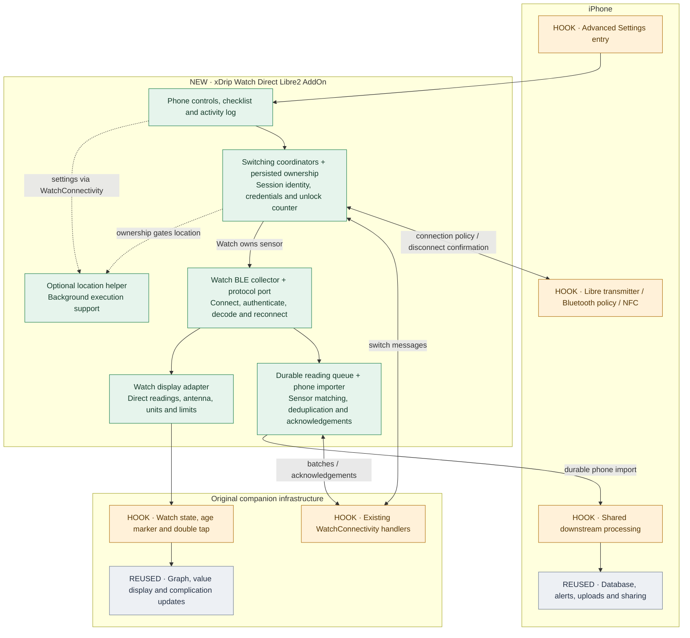

# Direct Libre 2: visual overview

The add-on moves an already working Libre 2 connection between xDrip on iPhone and Apple Watch. The phone controls switching; the Watch collects, displays and queues readings for the phone. Loop is outside this implementation.

## Where the feature lives

Green boxes are new add-on components. Amber boxes are original integration points we changed. Grey boxes are existing services we reuse. Labels also identify these roles so the diagram does not depend on colour.

The diagram groups responsibilities, rather than representing one box per file. Both handoff and history use the existing WatchConnectivity route. Location supports execution; it does not own Bluetooth, change counters or process glucose. The original phone NFC, crypto and parsing implementations remain in place; the Watch uses a protocol port within the add-on.

**Configuration sits beside this code:** Xcode target membership, corrected build locations, Bluetooth/location declarations and the retained underwater frontmost declaration. There is no depth reader, automatic Water Lock, workout session or new Watch alarm engine.

## How much changed

| Purpose | Files changed | Lines added | Lines deleted |
| --- | ---: | ---: | ---: |
| Add-on implementation | 40 | 4,799 | 0 |
| Tests and verification | 19 | 3,521 | 0 |
| Documentation | 5 | 429 | 0 |
| Original Swift hooks | 10 | 321 | 82 |
| Configuration and housekeeping | 6 | 407 | 7 |
| **Total** | **80** | **9,477** | **89** |

**Feature snapshot:** committed revision [`0a6b202`](https://github.com/rnederstigt/xdripswift/commit/0a6b202), including the location-accuracy controls, documented on 16 September 2026. Compared with audited upstream master commit [`53b3d6b`](https://github.com/JohanDegraeve/xdripswift/commit/53b3d6bf1b550c99b19c3d5d2c2f80dd226465d8), not an unverified current master. This visual documentation and its README link were added afterwards and are excluded. Personal signing settings remain local and are absent from the committed comparison. GitHub's branch-wide totals also include the later visual documentation, so they will be larger.

The chart measures **added text lines**, not runtime cost, code quality or behavioural risk. Configuration includes deletion of one tracked binary build artifact, counted as a file but not as text lines. Source moves/extractions can contribute to both additions and deletions.

Classification: add-on `Shared`, `Watch` and `iPhone` files are implementation; `Tests`, `Scripts` and `Package.swift` are verification; existing README/Docs files are documentation; Swift files outside the add-on are original hooks; remaining files are configuration/housekeeping. Reproduce the totals with `git diff --numstat 53b3d6b 0a6b202` (or `--shortstat` for the summary). These are fixed committed revisions, not an automatically updated badge.

## The original-code boundary

The 10 modified original Swift files cover six boundaries:

| Boundary | Original Swift files | Why a hook remains |
| --- | ---: | --- |
| Phone Bluetooth and NFC | 3 | Block competing phone authentication, observe login/readings, confirm disconnect and reset Direct Libre state through ordinary NFC. |
| Phone WatchConnectivity | 1 | Route handoff/history messages through the existing companion channel. |
| Phone downstream processing | 1 | Let imported Watch readings use existing processing, uploads and current-reading effects. |
| Advanced Settings | 1 | Open the experimental page. |
| Watch state model | 1 | Accept direct readings and messages; restore display preferences. |
| Watch views | 3 | Show the antenna and route the existing double tap to direct-mode recovery. |

Most implementation is isolated, but this is compiled into the existing targets, **not a dynamically removable plugin**. Small hooks can have important effects. Ordinary behaviour has explicit exceptions: NFC recovery after experiment use, counter-exhaustion protection, persisted Watch display preferences and the app-wide underwater declaration. The [audit](AUDIT.md) documents these instead of claiming complete upstream equivalence.

## Follow the behaviour

See the [switching and reading diagrams](SWITCHING.md) for the two disconnect barriers and the path from a Watch sample to phone processing. For implementation entry points and a suggested upstream porting order, use the [integration map](INTEGRATION.md). Tests and device limitations are in the [validation guide](TESTING.md).
