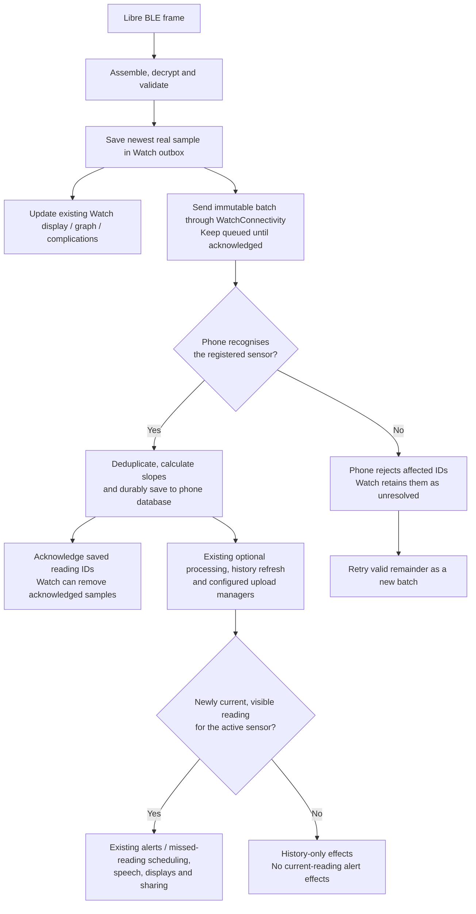

# Switching and reading flow

These diagrams describe successful paths. Messages carry sensor/session identity; stale IDs and invalid phase transitions are rejected. Both directions persist state and support interrupted transactions. A request to disconnect is never treated as confirmation that disconnection has finished.

## iPhone to Watch

Precondition: xDrip on iPhone has a valid recent native Libre BLE reading. Any transfer from another app to xDrip has already happened outside this feature.

```mermaid
sequenceDiagram
    actor User
    participant Phone as iPhone xDrip
    participant Watch as Watch xDrip
    participant Sensor as Libre 2
    User->>Phone: Connect to Watch (Advanced Settings)
    Phone->>Phone: Persist preparingWatch; freeze new authentication
    Note over Phone,Sensor: Existing phone BLE connection stays open during preparation
    Phone->>Watch: PREPARE(session, counter N)
    Watch->>Watch: Validate and persist Prepared state
    Watch-->>Phone: READY(session ID)
    Note over Watch,Sensor: Watch cannot connect yet
    Phone->>Phone: Persist releasingPhone; block phone BLE operations
    Phone->>Sensor: Request disconnect
    Sensor-->>Phone: CoreBluetooth confirms disconnected
    Phone->>Watch: ACTIVATE(session ID)
    Watch->>Watch: Persist Watch ownership
    Watch->>Sensor: Connect, discover F001/F002, subscribe to F002
    Sensor-->>Watch: Subscription confirmed
    Watch->>Watch: Reserve and persist counter N+1
    Watch->>Sensor: Write streaming unlock to F001 using N+1
    Note over Watch,Sensor: Attempted counters are never reused, even after connection loss
    Sensor-->>Watch: Glucose frames
```

The disconnect confirmation is the barrier between two devices being allowed to connect. The Watch saves each counter **before** attempting the unlock write. Persisted ownership also governs restart and reconnect behaviour.

## Watch readings to the phone



Only real samples enter the outbox; display interpolation is not uploaded. Unknown/deleted sensor mappings are separated without guessing a replacement sensor. A mixed batch is not partially imported before that rejection is resolved; transport or storage failure instead keeps the original batch pending. The phone keeps its existing exporter settings, cadence and historical cursor limitations. No new uploader or alarm engine is introduced.

## Watch to iPhone

```mermaid
sequenceDiagram
    actor User
    participant Phone as iPhone xDrip
    participant Watch as Watch xDrip
    participant Sensor as Libre 2
    User->>Phone: Return to iPhone (same Advanced Settings button)
    Phone->>Phone: Persist returnRequested; keep phone BLE blocked
    Phone->>Watch: REQUEST_RETURN(session ID)
    Watch->>Watch: Freeze new authentication at current counter M
    Watch->>Phone: RETURN_PREPARE(session, counter M)
    Phone->>Phone: Persist M and returningToPhone
    Phone-->>Watch: READY(session ID)
    Watch->>Watch: Persist releasingWatch; reconnect remains disabled
    Watch->>Sensor: Request disconnect
    Sensor-->>Watch: CoreBluetooth confirms disconnected
    Watch->>Phone: RETURN_COMMIT(session ID)
    Phone->>Phone: Restore phone ownership; retain counter M
    Phone-->>Watch: Acknowledge return
    Watch->>Watch: Retire handoff ID
    Phone->>Sensor: Resume existing connection procedure; next unlock uses M+1
```

If the Watch is unreachable, a software return cannot guarantee immediate disconnection. The ordinary phone Add/Connect NFC scan is the explicit recovery route: after Direct Libre use, it retires the session and reprovisions sensor credentials. A cancelled or failed reset does not grant phone BLE ownership. See [ordinary NFC recovery](INTEGRATION.md#ordinary-nfc-recovery).

## Execution support is separate

Optional location updates run only when enabled and the Watch owns the sensor; a new session starts while xDrip is active. Loss of ownership stops location. Missing location fixes do not disconnect BLE. The underwater declaration affects frontmost behaviour and adds no depth reader or automatic Water Lock. Neither mechanism guarantees uninterrupted execution or radio reception through water.

Return to the [architecture and change footprint](OVERVIEW.md).
